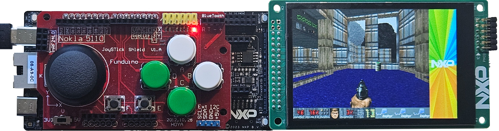
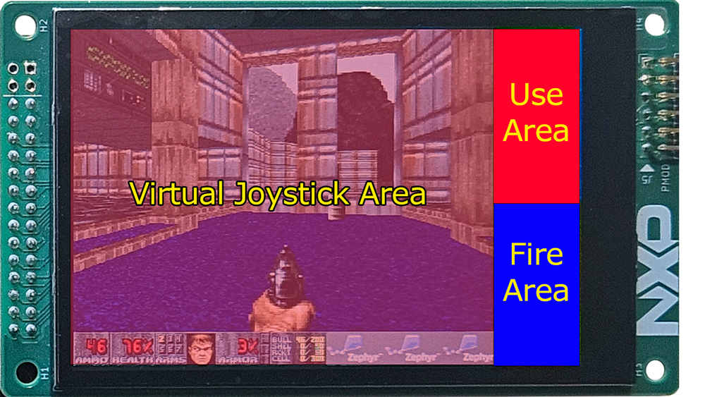
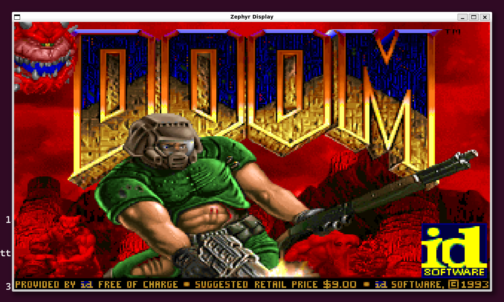

# Doom-MCX



A port of prBoom to NXP MCXN MCU running Zephyr RTOS

# Hardware

 | 
:-------------------------:|:-------------------------:
[FRDM Development Board for MCX N947](https://www.nxp.com/design/design-center/development-boards-and-designs/general-purpose-mcus/frdm-development-board-for-mcx-n94-n54-mcus:FRDM-MCXN947)  |  [LCD-PAR-S035 480x320 IPS LCD](https://www.nxp.com/design/design-center/development-boards-and-designs/general-purpose-mcus/3-5-480x320-ips-tft-lcd-module:LCD-PAR-S035)

Optional [Joystick shield](https://duckduckgo.com/?t=h_&q=funduino+board+joystick+shield&ia=web) on FRDM-MCXN947 Arduino Header


# Getting Started

Before getting started, make sure you have a proper Zephyr development
environment. Follow the official
[Zephyr Getting Started Guide](https://docs.zephyrproject.org/latest/getting_started/index.html).

> [!NOTE]  
> DOOM-MCX has been tested on Zephyr SDK version 0.17.0. When installing the sdk it's recommended to specify the version using `west sdk install --version 0.17.0`

### Initialization

The first step is to initialize the DOOM-MCX Zephyr workspace folder (``doom-mcx-workspace``) where ``doom-mcx`` and all Zephyr modules will be cloned. Run the following
command:

```shell
# initialize  for the example-application (main branch)
west init -m https://github.com/nxphovergames/doom-mcx --mr main doom-mcx-workspace
# update Zephyr modules
cd doom-mcx-workspace
west update
```

### Building

To build the application, run the following command:

```shell
cd doom-mcx
west build -p always -b frdm_mcxn947/mcxn947/cpu0
```

### Flashing

> [!NOTE]  
> [NXP Linkserver](https://www.nxp.com/design/design-center/software/development-software/mcuxpresso-software-and-tools-/linkserver-for-microcontrollers:LINKERSERVER) v1.5.30 or newer has to be installed. See [Zephyr LinkServer guide](https://docs.zephyrproject.org/latest/develop/flash_debug/host-tools.html#linkserver-debug-host-tools) for more information.

To flash the application to the FRDM-MCXN947 board. Connect a USB-C cable to the "MCU-Link" USB-C port and run the following command:

```shell
west flash
```

### Doom-MCX Controls

Doom-MCX supports 2 types of control either through touchscreen or the [Joystick shield](https://duckduckgo.com/?t=h_&q=funduino+board+joystick+shield&ia=web).

#### Touchscreen controls
**Open doors/start:** Tap "Use Area"  
**Fire:** Tap "Fire Area"  
**Wake & Strafe** Tap and drag in the "Virtual Joystick Area"



> [!CAUTION]  
> When using the Funduino shield make sure the switch is in 3V3 mode, otherwise you will damage the board.

#### Joytick Shield controls
**Fire:** D  
**Use:** C  
**Walk:** Joystick Y-axis  
**Strafe:** Joystick X-axis  
**Menu:** A

# Simulation on PC

Zephyr RTOS also provides a native_posix target

To compile as native type:
```shell
west build -p always -b native_posix_64
```

To run type
```shell
cd doom-mcx
./build/zephyr/zephyr.elf
```

### native_posix controls
**Fire:** CTRL  
**Use:** Spacebar  
**Walk:** Up-arrow & Down-arrow  
**Strafe:** Left-arrow & Right-arrow  
**Menu:** ESC

